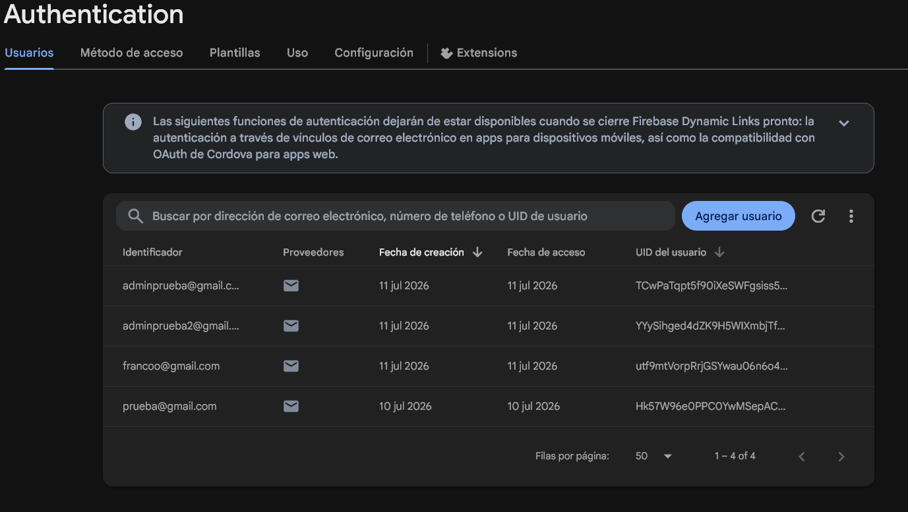
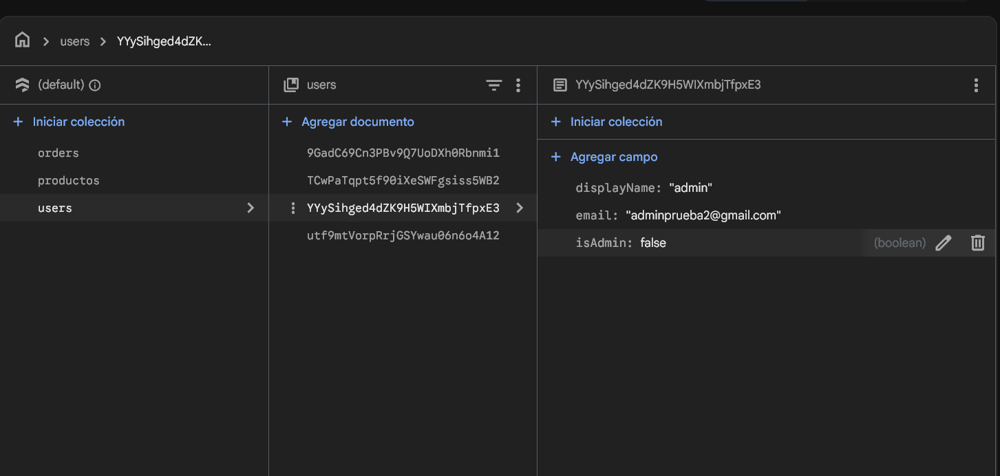
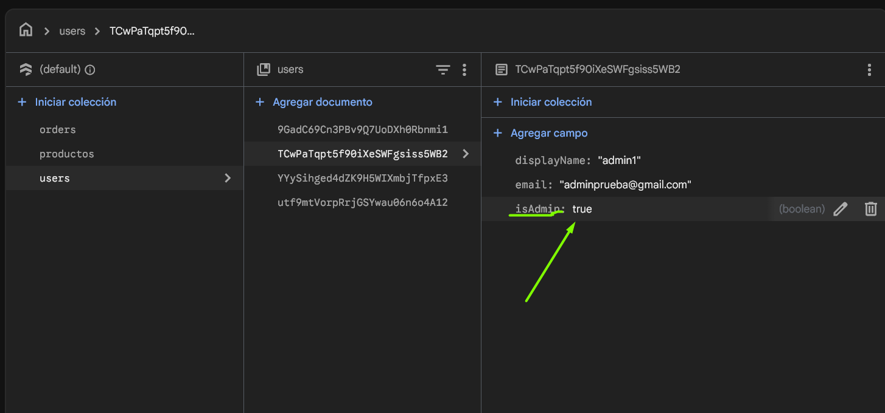
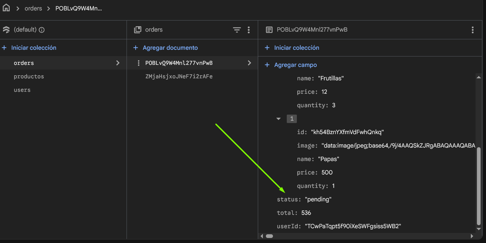

# Verduleria React E-commerce

Esta es la entrega final de la aplicacion e-commerce para Verduleria Colon, una plataforma web desarrollada en React orientada a la compra de frutas, verduras y productos organicos frescos directamente al consumidor. En esta version final, el sistema se conecta a Firebase Firestore para la persistencia de datos en tiempo real e incorpora herramientas de gestion y administracion de productos.

## Como iniciar

### Requisitos previos

- Node.js (version 18 o superior)
- Npm
- Una cuenta de Firebase con un proyecto activo, inciar proyecto 
  para base de datos Firestore y autenticacion

### Instalacion y ejecucion

1. Instalar las dependencias del proyecto:
   ```bash
   npm install
   ```

2. Configurar las variables de entorno:
   Crear un archivo `.env.local` en la raiz del proyecto y completar con las credenciales de Firebase:
   ```env
   VITE_FIREBASE_API_KEY=tu_api_key
   VITE_FIREBASE_AUTH_DOMAIN=tu_auth_domain
   VITE_FIREBASE_PROJECT_ID=tu_project_id
   VITE_FIREBASE_STORAGE_BUCKET=tu_storage_bucket
   VITE_FIREBASE_MESSAGING_SENDER_ID=tu_sender_id
   VITE_FIREBASE_APP_ID=tu_app_id
   ```

3. Iniciar el servidor de desarrollo local:
   ```bash
   npm run dev
   ```

4. Abrir en el navegador la direccion:
   `http://localhost:5173`

## Caracteristicas principales

- Catalogo interactivo: Navegacion por categorias de productos (Frutas, Verduras, Bebidas, Otros) y busqueda dinamica.
- Gestion de carrito de compras: Control de cantidades, calculo automatico de subtotales y total de la compra.
- Proceso de checkout: Registro de datos de cliente, verificacion de stock en tiempo real y generacion de orden de compra en base de datos.
- Sistema de autenticacion: Registro e inicio de sesion de usuarios con Firebase Authentication.
- Panel de administracion protegido: Panel exclusivo para administradores que permite crear, editar, eliminar y actualizar el stock de forma masiva (bulk).
- Compresion de imagenes incorporada: Reduccion de tamaño de imagenes en el cliente mediante compresion a formato JPEG base64 (400x400) antes de ser guardadas directamente en Firestore.
- Optimizacion del rendimiento: Implementacion de cache en memoria mediante Context API para evitar consultas repetitivas innecesarias a la base de datos al cambiar de vista.

## Evolucion del proyecto por entregas

### Primera entrega: Estructura base
- Inicializacion del proyecto bajo el entorno de Vite.
- Creacion del sistema de componentes modulares reutilizables.
- Maquetacion inicial del NavBar (barra de navegacion), CartWidget (icono del carrito) e ItemListContainer (contenedor de presentacion).

### Segunda entrega: Navegacion y simulacion asincronica
- Integracion de React Router para la navegacion dinamica de multiples paginas sin recargar el navegador.
- Carga asincrona de informacion simulando consultas de red con Promesas.
- Implementacion de filtros de categorias dinamicos e ItemDetailContainer (vista en detalle del producto).
- Incorporacion de logica para el control de stock (ItemCount).

### Tercera entrega (Entrega final): Integracion y persistencia real
- Migracion de datos locales (mock) a una base de datos en la nube en tiempo real mediante Firebase Firestore.
- Desarrollo de la logica completa del carrito de compras (CartContext) que persiste el estado en la aplicacion.
- Implementacion de la creacion de ordenes de compra con control de stock transaccional en la base de datos.
- Creacion del sistema de autenticacion de usuarios.
- Diseño e integracion del panel de administracion para mutaciones de catalogo (crear, editar, borrar y edicion rapida en lote) con politicas de refresco de cache automaticas para evitar datos desactualizados en las vistas.

## Capturas de pantalla

### Autenticacion de usuarios

Muestra el panel de Firebase Authentication con la lista de usuarios registrados en la aplicacion, incluyendo cuentas de clientes y cuentas de administrador.

### Coleccion de usuarios en Firestore

Estructura de la coleccion de usuarios en Firestore, donde se vinculan los datos del perfil (nombre y correo electronico) con sus permisos correspondientes.

### Definicion de rol administrador

Detalle del documento de un usuario administrador en Firestore, configurado con el campo booleano isAdmin en true para habilitar el acceso al panel de administracion.

### Registro de ordenes de compra

Detalle de una orden de compra generada en la coleccion de pedidos de Firestore, registrando el desglose de productos (con sus imagenes comprimidas), cantidades, total de la transaccion, identificador del usuario y estado del pedido.


```
Verduleria Ecommerce

├─ eslint.config.js
├─ index.html
├─ opencode.jsonc
├─ package-lock.json
├─ package.json
├─ public
│  ├─ AuthenticationCap.png
│  ├─ favicon.png
│  ├─ favicon.svg
│  ├─ FirestoreAdminUserCap.png
│  ├─ FirestoreOrders.png
│  ├─ FirestoreUsersCap.png
│  └─ icons.svg
├─ README.md
├─ src
│  ├─ App.jsx
│  ├─ App.scss
│  ├─ assets
│  │  ├─ cat_bebidas.png
│  │  ├─ cat_frutas.png
│  │  ├─ cat_otros.png
│  │  ├─ cat_verduras.png
│  │  ├─ icon-verdu-colon.png
│  │  └─ Nosotros-hero.png
│  ├─ components
│  │  ├─ About.jsx
│  │  ├─ AdminProducts.jsx
│  │  ├─ Cart.jsx
│  │  ├─ CartWidget.jsx
│  │  ├─ CategoryFilter.jsx
│  │  ├─ Checkout.jsx
│  │  ├─ CreateProduct.jsx
│  │  ├─ Footer.jsx
│  │  ├─ Home.jsx
│  │  ├─ Item.jsx
│  │  ├─ ItemCount.jsx
│  │  ├─ ItemDetail.jsx
│  │  ├─ ItemDetailContainer.jsx
│  │  ├─ ItemList.jsx
│  │  ├─ ItemListContainer.jsx
│  │  ├─ Login.jsx
│  │  ├─ NavBar.jsx
│  │  ├─ NavDropdown.jsx
│  │  ├─ NotFound.jsx
│  │  ├─ ProtectedRoute.jsx
│  │  └─ ScrollToTop.jsx
│  ├─ context
│  │  ├─ CartContext.jsx
│  │  ├─ ProductsContext.jsx
│  │  ├─ useCart.js
│  │  ├─ useProducts.js
│  │  ├─ UserContext.jsx
│  │  └─ useUser.js
│  ├─ main.jsx
│  ├─ services
│  │  └─ firebase
│  │     ├─ authService.js
│  │     ├─ config.js
│  │     ├─ ordersService.js
│  │     └─ productsService.js
│  ├─ styles
│  │  ├─ index.scss
│  │  ├─ _about.scss
│  │  ├─ _admin.scss
│  │  ├─ _animations.scss
│  │  ├─ _base.scss
│  │  ├─ _cart.scss
│  │  ├─ _checkout.scss
│  │  ├─ _create-product.scss
│  │  ├─ _footer.scss
│  │  ├─ _home.scss
│  │  ├─ _item.scss
│  │  ├─ _login.scss
│  │  ├─ _mixins.scss
│  │  ├─ _navbar.scss
│  │  ├─ _notfound.scss
│  │  └─ _variables.scss
│  └─ utils
│     └─ imageCompression.js
└─ vite.config.js

```
```
Verduleria Ecommerce
├─ AGENTS.md
├─ eslint.config.js
├─ index.html
├─ opencode.jsonc
├─ package-lock.json
├─ package.json
├─ public
│  ├─ AuthenticationCap.png
│  ├─ favicon.png
│  ├─ FirestoreAdminUserCap.png
│  ├─ FirestoreOrders.png
│  ├─ FirestoreUsersCap.png
│  └─ Nosotros
│     ├─ confianza.jpg
│     ├─ delivey.png
│     └─ tierra.jpg
├─ README.md
├─ src
│  ├─ App.jsx
│  ├─ App.scss
│  ├─ assets
│  │  ├─ cat_bebidas.png
│  │  ├─ cat_frutas.png
│  │  ├─ cat_otros.png
│  │  ├─ cat_verduras.png
│  │  ├─ icon-verdu-colon.png
│  │  └─ Nosotros-hero.png
│  ├─ components
│  │  ├─ admin
│  │  │  ├─ AdminProducts.jsx
│  │  │  └─ CreateProduct.jsx
│  │  ├─ auth
│  │  │  ├─ Login.jsx
│  │  │  └─ ProtectedRoute.jsx
│  │  ├─ carrito
│  │  │  ├─ Cart.jsx
│  │  │  └─ Checkout.jsx
│  │  ├─ comunes
│  │  │  ├─ CartWidget.jsx
│  │  │  ├─ Footer.jsx
│  │  │  ├─ NavBar.jsx
│  │  │  ├─ NavDropdown.jsx
│  │  │  └─ ScrollToTop.jsx
│  │  ├─ error
│  │  │  └─ NotFound.jsx
│  │  ├─ informacion
│  │  │  ├─ About.jsx
│  │  │  └─ Policies.jsx
│  │  └─ productos
│  │     ├─ CategoryFilter.jsx
│  │     ├─ Home.jsx
│  │     ├─ Item.jsx
│  │     ├─ ItemCount.jsx
│  │     ├─ ItemDetail.jsx
│  │     ├─ ItemDetailContainer.jsx
│  │     ├─ ItemList.jsx
│  │     └─ ItemListContainer.jsx
│  ├─ context
│  │  ├─ CartContext.jsx
│  │  ├─ ProductsContext.jsx
│  │  ├─ useCart.js
│  │  ├─ useProducts.js
│  │  ├─ UserContext.jsx
│  │  └─ useUser.js
│  ├─ main.jsx
│  ├─ services
│  │  └─ firebase
│  │     ├─ authService.js
│  │     ├─ config.js
│  │     ├─ ordersService.js
│  │     └─ productsService.js
│  ├─ styles
│  │  ├─ index.scss
│  │  ├─ _about.scss
│  │  ├─ _admin.scss
│  │  ├─ _animations.scss
│  │  ├─ _base.scss
│  │  ├─ _cart.scss
│  │  ├─ _checkout.scss
│  │  ├─ _create-product.scss
│  │  ├─ _footer.scss
│  │  ├─ _home.scss
│  │  ├─ _item.scss
│  │  ├─ _login.scss
│  │  ├─ _mixins.scss
│  │  ├─ _navbar.scss
│  │  ├─ _notfound.scss
│  │  ├─ _politicas.scss
│  │  └─ _variables.scss
│  └─ utils
│     └─ imageCompression.js
└─ vite.config.js

```